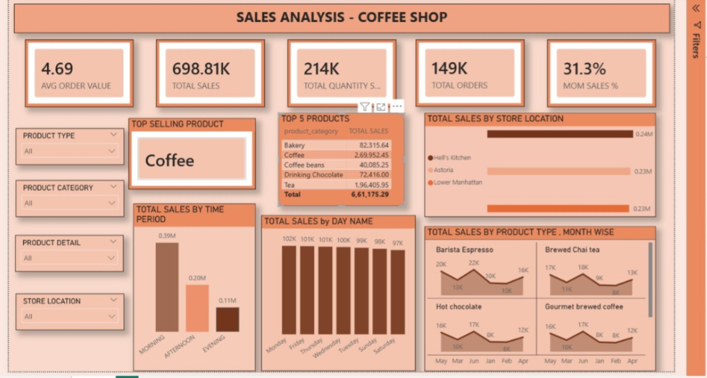
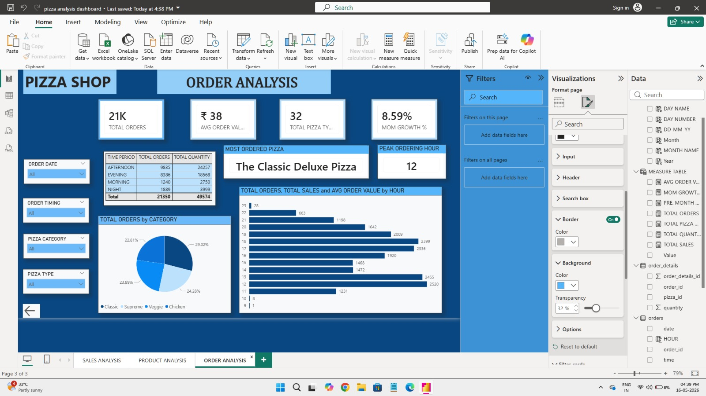
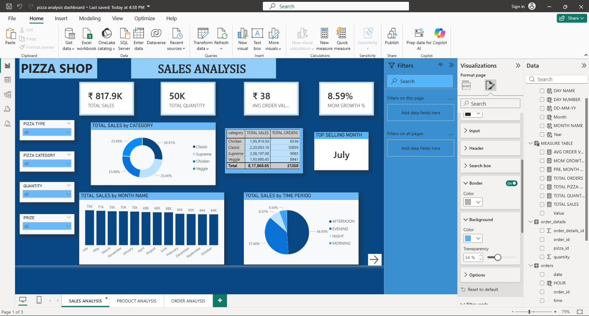
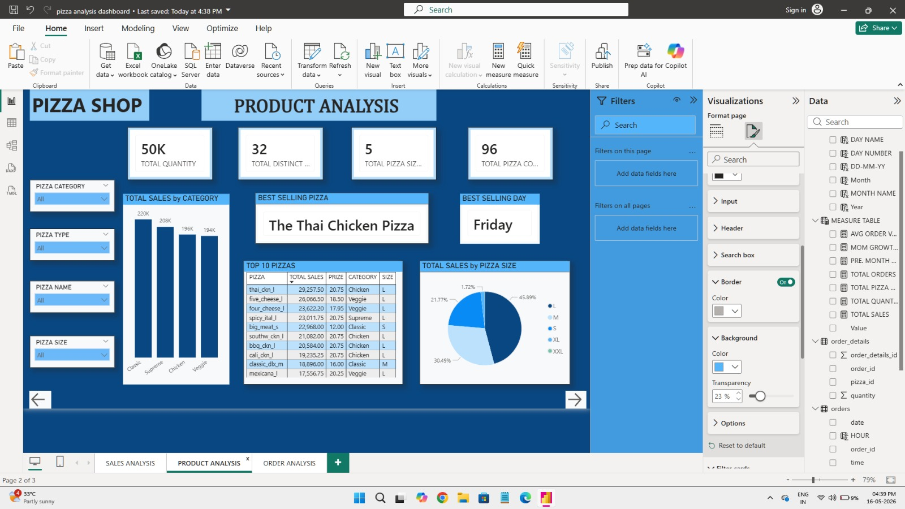

# Data Analytics Projects - Kaviya Vaseekaran

## Project 1 — Coffee Shop Sales Analysis (Power BI)

Analyzed coffee shop transaction data to identify sales trends across products, store locations and time periods.

Key KPIs:
- Total Sales: 6.61L
- Average Order Value: 4.69
- Total Orders: 149K
- MOM Sales %: 31.3%

Tools used: Power BI, DAX

[Download Dashboard](coffee%20shop%20dashboard.pbix)

---

## Project 2 — Pizza Shop Sales Analysis (Power BI)

3-page interactive dashboard analyzing pizza shop performance across sales, products and orders.

- Page 1: Total sales ₹8.17L, MOM growth tracking, sales by category and time period
- Page 2: Top 10 pizzas, best seller Thai Chicken, best selling day Friday, sales by pizza size
- Page 3: 21K total orders, peak ordering hour analysis, orders by category

Tools used: Power BI, DAX

[Download Dashboard](pizza%20analysis%20dashboard.pbix)

---

## Project 3 — Telecom Customer Analysis (Excel)

Interactive Excel dashboard analyzing telecom customer behavior, churn patterns, and service usage across regions.

- Total Customers: 49, Avg. Tenure: 19 months, Avg. Age: 35
- Churn analysis filtered by gender, region, and service type
- Tenure and age distribution across customer segments
- Internet usage: 65% subscribed, Call card usage: 53% active
- Customer category breakdown — Basic, E-service, Plus, and Total service

Tools used: Microsoft Excel, Pivot Tables, Pivot Charts, Slicers

[Download Dashboard](telcom%20DASH%20BOARD.xlsx)

## Project 4 — HR Analytics Dashboard (Excel)

Interactive Excel dashboard analyzing employee attrition, salary, and workforce demographics for 1,470 employees.

- Employee Count: 1,470, Attrition Count: 45, Avg. Salary Hike: 15.44%, Avg. Age: 32
- Attrition breakdown filtered by gender, overtime, and attrition status
- Job role distribution — Research Scientist 27%, Sales Executive 22%
- Department split — Sales 49%, R&D 44%, HR 7%
- Salary hike and age group analysis across workforce

Tools used: Microsoft Excel, Pivot Tables, Pivot Charts, Slicers

[Download Dashboard](EXCEL%20PROJECT%20ONE.xlsx)

## Project 5 — Retail Sales Analysis (SQL)

30-question SQL analysis on a retail sales dataset covering orders, customers, products, returns, and regional performance.

- Joins across 6 tables — sales, customers, products, regions, subcategories, returns
- Order analysis by region, category, product, and time period
- Customer segmentation by gender, marital status, and income
- Return analysis by product, category, and region
- Created a consolidated view combining all tables for efficient querying

Tools used: PostgreSQL
View SQL File

## Project 6 — Coming Soon

Currently working on next project. Stay tuned!!!

